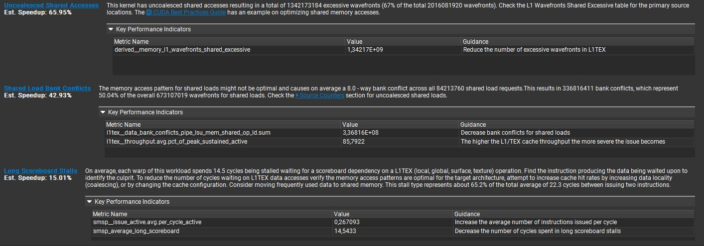
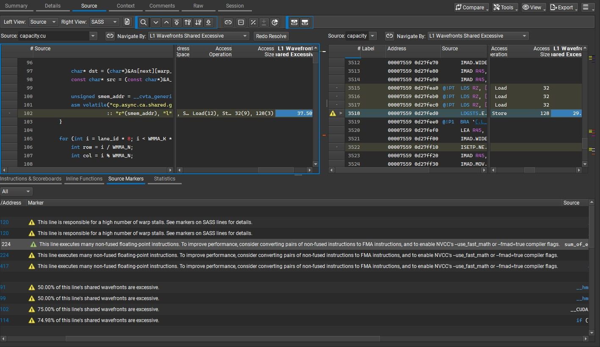
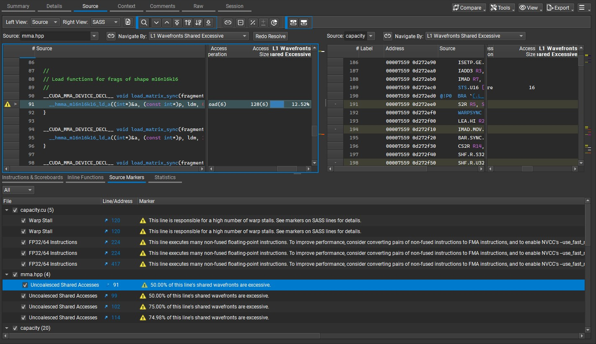
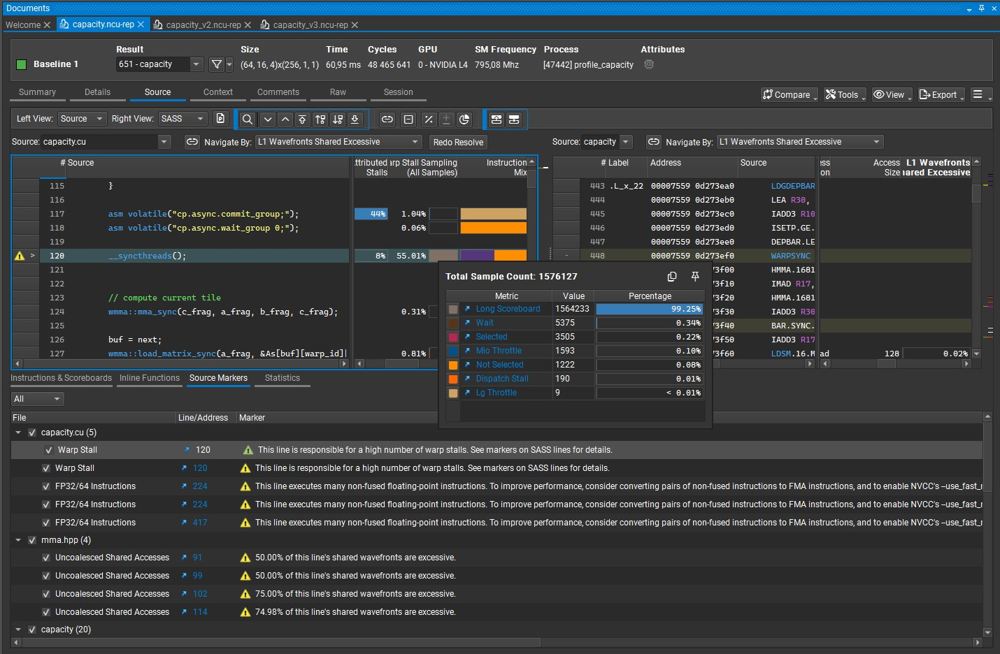

 # Run 1 — Nsight Compute: Summary

Kernels profiled: [unfused.cu](kernels/unfused.cu), [baseline.cu](kernels/baseline.cu) and [capacity.cu](kernels/capacity.cu)

 Overview
 --------
The timings reported for the three workflows ([unfused.cu](kernels/unfused.cu), [baseline.cu](kernels/baseline.cu), and [capacity.cu](kernels/capacity.cu)) use a small configuration — larger configurations cause the device to run out of memory for the [unfused.cu](kernels/unfused.cu) variant. Larger configurations will be used subsequently for next profilins runs: we will increase `N` to `1024` for the `prefill` pipeline (with `num_batches = 256`) and set `N=1` for the `decode` pipeline (with `num_batches = 2048`)

 "Small" configuration:
 -------------
 ```cpp
 constexpr int N = 256;
 constexpr int d_model = 4096;
 constexpr int num_batches = 4;
 constexpr int num_experts = 32;
 constexpr int up_proj_dim = 4;
 ```

 Executive Summary
 -----------------
 - **Unfused (aggregated):** 2034 ms - WMMA `up_proj` / `Swiglu` / `down_proj` kernels dominate `99%` of runtime (per-kernel traces).
 - **Baseline:** 54 ms — elevated DRAM utilization and replay indicate potential locality and coalescing issues.
 - **Capacity:** 37 ms — demonstrates improved runtime due to more efficient per-expert buffering and a better compute/memory balance.

Observations
------------
- **Kernel Fusion:** Delivers substantial benefits in this workload; prioritize reducing redundant memory traffic and improving data locality. Measured improvement for the fused implementation is approximately **37×** over the unfused workflow.
- **Per‑Expert Allocation:** Capacity-aware buffer sizing materially improves performance compared with naive over-allocation — the `capacity` variant shows roughly **+46%** speedup versus `baseline` under this configuration.
- **Primary Hotspots:** WMMA `up_proj` and `down_proj` kernels dominate the unfused runtime and should be the first optimization targets.
- **Memory vs Compute:** The `baseline` variant exhibits DRAM-bound behavior; the `capacity` variant shifts the workload toward better compute utilization.

The [unfused.cu](kernels/unfused.cu) variant produces separate kernel traces and is not included in the aggregated tables below.

## GPU Speed Of Light Throughput

> <u>Comment:</u> Crucial metrics all increased: Memory Throughput, DRAM Throughput, Compute Throughput, and both cache throughputs.

| Metric Name | Metric Unit | baseline | capacity |
|---|---:|---:|---:|
| DRAM Frequency | Ghz | 6.24 | 6.24 |
| SM Frequency | Mhz | 808.31 | 809.43 |
| Elapsed Cycles | cycle | 44,375,658 | 30,252,365 |
| Memory Throughput | % | 73.99 | 86.05 |
| DRAM Throughput | % | 73.99 | 86.05 |
| Duration | ms | 54.34 | 37.01 |
| L1/TEX Cache Throughput | % | 59.36 | 83.86 |
| L2 Cache Throughput | % | 27.61 | 32.84 |
| SM Active Cycles | cycle | 43,076,305.84 | 29,384,125.02 |
| Compute (SM) Throughput | % | 26.35 | 33.40 |

**Comments from NCU:**

- `capacity` (INF): "This workload is utilizing greater than 80.0% of the available compute or memory performance of the device. To further improve performance, work will likely need to be shifted from the most utilized to another unit. Start by analyzing DRAM in the Memory Workload Analysis section." (from `ncu_capacity.txt`)
- `baseline` (OPT): "Memory is more heavily utilized than Compute: Look at the Memory Workload Analysis section to identify the DRAM bottleneck. Check memory replay (coalescing) metrics to make sure you're efficiently utilizing the bytes transferred. Also consider whether it is possible to do more work per memory access (kernel fusion) or whether there are values you can (re)compute." (from `ncu_baseline.txt`)


## Launch Statistics

> <u>Comment:</u> No change in Launch Statisticts.

| Metric Name | Metric Unit | baseline | capacity |
|---|---:|---:|---:|
| Block Size |  | 256 | 256 |
| Function Cache Configuration |  | CachePreferNone | CachePreferNone |
| Grid Size |  | 2048 | 2048 |
| Registers Per Thread | register/thread | 72 | 72 |
| Shared Memory Configuration Size | Kbyte | 102.40 | 102.40 |
| Driver Shared Memory Per Block | Kbyte/block | 1.02 | 1.02 |
| Dynamic Shared Memory Per Block | byte/block | 0 | 0 |
| Static Shared Memory Per Block | Kbyte/block | 33.02 | 33.02 |
| # SMs | SM | 58 | 58 |
| Stack Size |  | 1024 | 1024 |
| Threads | thread | 524,288 | 524,288 |
| # TPCs |  | 29 | 29 |
| Enabled TPC IDs |  | all | all |
| Uses Green Context |  | 0 | 0 |
| Waves Per SM |  | 11.77 | 11.77 |

Note: the `33.02 Kbyte/block` static shared-memory figure comes from two WMMA double-buffer regions plus small routing scratch arrays. Each WMMA region allocates `2 x 8 x 16 x 16 x 2 B = 16384 B`, where `2` is the double-buffer stage count, `8` is `WARP_TILES_X * WARP_TILES_Y = 4 * 2` warps per block, `16 x 16` is one WMMA tile, and `2 B` is the size of a half value. The fused `baseline` and `capacity` kernels instantiate two such regions (`16384 + 16384`) and add `256 B` for `max_vals` and `max_indices`, for a total of `33024 B = 33.024 kB`.

## Occupancy

> <u>Comment:</u> Restrictive limits on block count in both kernels due to SRAM and Register pressure..

| Metric Name | Metric Unit | baseline | capacity |
|---|---:|---:|---:|
| Block Limit SM | block | 24 | 24 |
| Block Limit Registers | block | 3 | 3 |
| Block Limit Shared Mem | block | 3 | 3 |
| Block Limit Warps | block | 6 | 6 |
| Theoretical Active Warps per SM | warp | 24 | 24 |
| Theoretical Occupancy | % | 50 | 50 |
| Achieved Occupancy | % | 49.19 | 49.21 |
| Achieved Active Warps Per SM | warp | 23.61 | 23.62 |

**Comments:**

- `capacity` (OPT): "Est. Local Speedup: 50% ... The 6.00 theoretical warps per scheduler this kernel can issue according to its occupancy are below the hardware maximum of 12. This kernel's theoretical occupancy (50.0%) is limited by the number of required registers, and the required amount of shared memory." (from `ncu_capacity.txt`)
- `baseline` (OPT): same note present in `ncu_baseline.txt`.


## GPU and Memory Workload Distribution

| Metric Name | Metric Unit | baseline | capacity | % change |
|---|---:|---:|---:|---:|
| Average DRAM Active Cycles | cycle | 251,039,152 | 198,884,450.67 | -20.8% |
| Total DRAM Elapsed Cycles | cycle | 2,035,861,504 | 1,386,791,936 | -31.9% |
| Average L1 Active Cycles | cycle | 43,076,305.84 | 29,384,125.02 | -31.8% |
| Total L1 Elapsed Cycles | cycle | 2,568,514,988 | 1,734,920,676 | -32.5% |
| Average L2 Active Cycles | cycle | 44,579,837.38 | 30,219,466.58 | -32.2% |
| Total L2 Elapsed Cycles | cycle | 1,075,838,280 | 732,841,152 | -31.9% |
| Average SM Active Cycles | cycle | 43,076,305.84 | 29,384,125.02 | -31.8% |
| Total SM Elapsed Cycles | cycle | 2,568,514,988 | 1,734,920,676 | -32.5% |
| Average SMSP Active Cycles | cycle | 43,073,554.39 | 29,378,060.27 | -31.8% |
| Total SMSP Elapsed Cycles | cycle | 10,274,059,952 | 6,939,682,704 | -32.5% |


---


## Selective Nsight Compute Analysis

This section presents a focused analysis of Nsight Compute results for [capacity.cu](kernels/capacity.cu). 

It highlights the primary bottlenecks, the source-level causes identified by the profiler, and concise recommendations for targeted fixes. For broader comparisons and additional detail see [Run 2](prof/md/run2/ncu_details.md).



Root cause summary
------------------
- The dominant contributors to the observed bottlenecks are the explicit DRAM→shared-memory copy operations for matrices `A` and `B`, implemented with PTX `cp.async.ca.shared.global` instructions. These copies appear as the primary sources of uncoalesced accesses.



- Additional uncoalesced/shared-access events are attributed to the WMMA load path (`wmma::load_matrix_sync`). Nsight Compute reports these indirectly (via `mma.hpp`/NVidia headers), so the profiler maps them to the helper headers rather than the user source file.



Synchronization issue
---------------------
- The `__syncthreads()` barrier present after the `cp.async` sequence contributes heavily to warp stalls (profile reports ~58% of stalls). It appears unnecessary because each warp writes into its own warp-indexed shared buffer slot and `cp.async.wait_group 0` already establishes the required ordering for that warp's async copies. Removing this redundant barrier will reduce warp stalls without changing correctness when the per-warp buffer convention is preserved.


