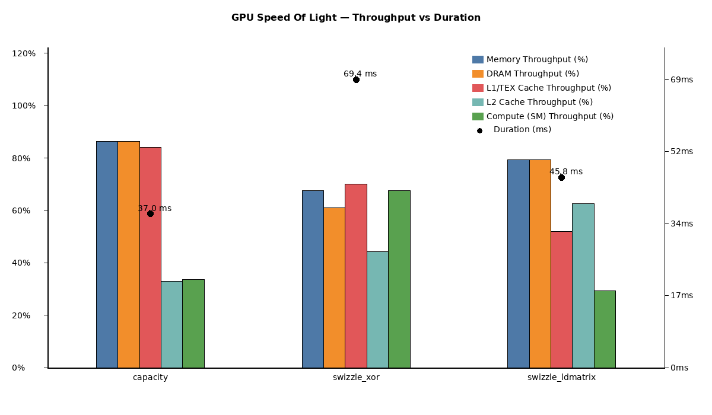

# Nsight Compute: Swizzling with XOR

Kernels profiled: [capacity.cu](kernels/capacity.cu), [swizzle_xor.cu](kernels/swizzle_xor.cu) and [swizzle_ldmatrix.cu](kernels/swizzle_ldmatrix.cu).

## Overview
This report summarizes the two applications of swizzling below and compares them to the base version [capacity.cu](kernels/capacity.cu):
- [swizzle_xor](kernels/swizzle_xor.cu) - XOR swizzle
- [swizzle_ldmatrix](kernels/swizzle_ldmatrix.cu) - swizzle via `ldmatrix.sync.aligned` and `mma.sync.aligned.m16n8k16.row.col.f32.f16.f16.f32` 

Both swizzling approaches / thread mapping permutations were applied at 16-byte chunk granularity to match the `cp.async` transaction size and reduce bookkeeping overhead. The aim of this file is to document and explain why neither of the applications yielded performance improvement.


## XOR swizzle

```cpp
        for (int i = lane_id * 8; i < WMMA_M * WMMA_K; i += 32 * 8) {
            int row = i / WMMA_K;
            int col = i % WMMA_K;
            int col_chunk = col >> 3; // 8 half = 16B chunk
            int col_chunk_swz = col_chunk ^ (row & SWIZZLE_CHUNK_MASK);
            int col_swz = col_chunk_swz << 3;

            char* dst = (char*)&As[stage_buf][warp_id][row][col_swz];
```

Subsequently, the unswizzle step is applied prior to invoking `wmma::load_matrix_sync`, the swizzled tile in shared memory is restored (unswizzled) to the linear layout expected by the WMMA API.

The transformations (swizzle + unswizzle) add index arithmetic and increase instruction count.


The XOR swizzle implemented in this experiment operates at 16‑byte chunk granularity (groups of eight 2‑byte elements). In this pattern odd rows swap the two eight‑chunk halves; an illustrative mapping follows:

| Row | Chunks 0–7 | Chunks 8–15 |
|---:|:---|:---|
| 0 | 0 1 2 3 4 5 6 7 | 8 9 10 11 12 13 14 15 |
| 1 | 8 9 10 11 12 13 14 15 | 0 1 2 3 4 5 6 7 |
| 2 | 0 1 2 3 4 5 6 7 | 8 9 10 11 12 13 14 15 |
| 3 | 8 9 10 11 12 13 14 15 | 0 1 2 3 4 5 6 7 |

This compact representation highlights the per‑row XOR permutation used for the shared‑memory tile layout.

### Example — XOR swizzle (16-byte chunks)
```cpp
// col: column index (element index within row)
// row: row index
// We operate on 16-byte chunks = groups of 8 elements (2 bytes each)
int chunk = col >> 3;                 // chunk index (col / 8)
int lane = col & 0x7;                 // position within chunk

// Simple per-row XOR swizzle: flip halves for odd rows
int chunk_swizzled = chunk ^ (row & 1);

// Reconstruct swizzled column index (in elements)
int col_swizzled = (chunk_swizzled << 3) | lane;

// --- inverse (unswizzle) ---
int chunk_unswizzled = chunk_swizzled ^ (row & 1);
int col_unswizzled = (chunk_unswizzled << 3) | lane;

// Use `col_swizzled` as the shared-memory destination index when writing
// and apply the inverse before calling WMMA load.
```

## ldmatrix swizzle

Replace `wmma::load_matrix_sync` and `wmma::mma_sync` with a swizzle using a PTX approach:

1. `cp.async` stages tiles into shared memory in a simple linear layout.
2. `ldmatrix` loads warp fragments directly from shared memory into registers.
3. `mma.sync` consumes those registers directly for tensor-core MMA operations.

My intention of this approach was to move closer to the layout strategy used in low-level libraries such as CUTLASS.

```cpp
static __device__ __forceinline__ void ldmatrix_a_m16n8k16(
    const half* tile,
    int lane_id,
    int ld,
    unsigned (&a)[4]
)
{
    // Matrix order expected by mma.sync: top-left, bottom-left, top-right, bottom-right.
    int group = lane_id >> 3;
    int row = (lane_id & 7) + ((group & 1) << 3);
    int col = (group >> 1) << 3;
    unsigned addr = smem_addr(tile + row * ld + col);
    asm volatile(
        "ldmatrix.sync.aligned.x4.m8n8.shared.b16 {%0, %1, %2, %3}, [%4];\n"
        : "=r"(a[0]), "=r"(a[1]), "=r"(a[2]), "=r"(a[3])
        : "r"(addr));
}

static __device__ __forceinline__ void ldmatrix_b_m16n8k16(
    const half* tile,
    int lane_id,
    int ld,
    int col_block,
    unsigned (&b)[2]
)
{
    // For .x2, threads 16-31 can reuse the lower-thread addresses.
    int group = (lane_id >> 3) & 1;
    int row = (lane_id & 7) + (group << 3);
    unsigned addr = smem_addr(tile + row * ld + col_block);
    asm volatile(
        "ldmatrix.sync.aligned.x2.trans.m8n8.shared.b16 {%0, %1}, [%2];\n"
        : "=r"(b[0]), "=r"(b[1])
        : "r"(addr));
}

static __device__ __forceinline__ void mma_m16n8k16_f32(
    const unsigned (&a)[4],
    const unsigned (&b)[2],
    float (&c)[4]
)
{
    asm volatile(
        "mma.sync.aligned.m16n8k16.row.col.f32.f16.f16.f32 "
        "{%0, %1, %2, %3}, {%4, %5, %6, %7}, {%8, %9}, {%0, %1, %2, %3};\n"
        : "+f"(c[0]), "+f"(c[1]), "+f"(c[2]), "+f"(c[3])
        : "r"(a[0]), "r"(a[1]), "r"(a[2]), "r"(a[3]), "r"(b[0]), "r"(b[1]));
}
```

## NCU — High-level results

Summary: both swizzling attempts resulted in deterioration of perfomance due to the decrease in Memory & DRAM thoughput. 



### GPU Speed Of Light Throughput

| Metric Name | Metric Unit | capacity | swizzle_xor | swizzle_ldmatrix |
|---|---|---:|---:|---:|
| DRAM Frequency | GHz | 6.24 | 6.24 | 6.24 |
| SM Frequency | MHz | 804.67 | 822.95 | 803.42 |
| Elapsed Cycles | cycle | 30063030 | 57658205 | 37175334 |
| Memory Throughput | % | 86.24 | 67.62 | 79.42 |
| DRAM Throughput | % | 86.24 | 61.07 | 79.42 |
| Duration | ms | 36.97 | 69.37 | 45.81 |
| L1/TEX Cache Throughput | % | 84.05 | 70.02 | 52.05 |
| L2 Cache Throughput | % | 32.88 | 44.36 | 62.63 |
| SM Active Cycles | cycle | 29320941.95 | 55109655.78 | 35857617.72 |
| Compute (SM) Throughput | % | 33.63 | 67.62 | 29.40 |

Comments:
- capacity: INF This workload is utilizing greater than 80.0% of the available compute or memory performance of the device. To further improve performance, work will likely need to be shifted from the most utilized to another unit. Start by analyzing DRAM in the Memory Workload Analysis section.
- swizzle_xor: INF Compute and Memory are well-balanced: To reduce runtime, both computation and memory traffic must be reduced. Check both the Compute Workload Analysis and Memory Workload Analysis sections.
- swizzle_ldmatrix: OPT Memory is more heavily utilized than Compute: Look at the Memory Workload Analysis section to identify the DRAM bottleneck. Check memory replay (coalescing) metrics to make sure you're efficiently utilizing the bytes transferred. Also consider whether it is possible to do more work per memory access (kernel fusion) or whether there are values you can (re)compute.

### Launch Statistics

> **Comment:**

| Metric Name | Metric Unit | capacity | swizzle_xor | swizzle_ldmatrix |
|---|---|---:|---:|---:|
| Block Size |  | 256 | 256 | 256 |
| Function Cache Configuration |  | CachePreferNone | CachePreferNone | CachePreferNone |
| Grid Size |  | 2048 | 2048 | 2048 |
| Registers Per Thread | register/thread | 72 | 80 | 72 |
| Shared Memory Configuration Size | KiB | 102.40 | 102.40 | 102.40 |
| Driver Shared Memory Per Block | KiB/block | 1.02 | 1.02 | 1.02 |
| Dynamic Shared Memory Per Block | byte/block | 0 | 0 | 0 |
| Static Shared Memory Per Block | KiB/block | 33.02 | 32.77 | 32.77 |
| # SMs | SM | 58 | 58 | 58 |
| Stack Size |  | 1024 | 1024 | 1024 |
| Threads | thread | 524288 | 524288 | 524288 |
| # TPCs |  | 29 | 29 | 29 |
| Enabled TPC IDs |  | all | all | all |
| Uses Green Context |  | 0 | 0 | 0 |
| Waves Per SM |  | 11.77 | 11.77 | 11.77 |

## Occupancy

| Metric Name | Metric Unit | capacity | swizzle_xor | swizzle_ldmatrix |
|---|---|---:|---:|---:|
| Block Limit SM | block | 24 | 24 | 24 |
| Block Limit Registers | block | 3 | 3 | 3 |
| Block Limit Shared Mem | block | 3 | 3 | 3 |
| Block Limit Warps | block | 6 | 6 | 6 |
| Theoretical Active Warps per SM | warp | 24 | 24 | 24 |
| Theoretical Occupancy | % | 50 | 50 | 50 |
| Achieved Occupancy | % | 49.19 | 48.99 | 48.93 |
| Achieved Active Warps Per SM | warp | 23.61 | 23.51 | 23.49 |

Comments (same for all):
- OPT Est. Local Speedup: 50%. The 6.00 theoretical warps per scheduler this kernel can issue according to its occupancy are below the hardware maximum of 12. This kernel's theoretical occupancy (50.0%) is limited by the number of required registers, and the required amount of shared memory.

## GPU and Memory Workload Distribution

| Metric Name | Metric Unit | capacity | capacity % | swizzle_xor | swizzle_xor % | swizzle_ldmatrix | swizzle_ldmatrix % |
|---|---|---:|---:|---:|---:|---:|---:|
| Average DRAM Active Cycles | cycle | 199,112,960 | - | 264,573,200 | - | 227,192,048 | - |
| Average L1 Active Cycles | cycle | 29,320,942 | - | 55,109,656 | - | 35,857,618 | - |
| Average L2 Active Cycles | cycle | 30,315,918 | - | 56,303,511 | - | 37,590,135 | - |
| Average SM Active Cycles | cycle | 29,320,942 | - | 55,109,656 | - | 35,857,618 | - |
| Average SMSP Active Cycles | cycle | 29,318,293 | - | 55,079,822 | - | 35,844,260 | - |
| Total DRAM Elapsed Cycles | cycle | 1,385,345,024 | 11.1% | 2,599,341,056 | 10.9% | 1,716,303,872 | 11.1% |
| Total L1 Elapsed Cycles | cycle | 1,723,078,788 | 13.8% | 3,309,925,018 | 13.9% | 2,141,142,518 | 13.8% |
| Total L2 Elapsed Cycles | cycle | 732,076,992 | 5.9% | 1,378,815,744 | 5.8% | 906,970,200 | 5.9% |
| Total SM Elapsed Cycles | cycle | 1,723,078,788 | 13.8% | 3,309,925,018 | 13.9% | 2,141,142,518 | 13.8% |
| Total SMSP Elapsed Cycles | cycle | 6,892,315,152 | 55.3% | 13,239,700,072 | 55.5% | 8,564,570,072 | 55.4% |
| **Sum of Total Elapsed** | **cycle** | **12,455,894,744** | **100.0%** | **23,837,706,908** | **100.0%** | **15,470,129,180** | **100.0%** |

Note:
- The ratio between `Total ... Elapsed Cycles` and `Average ... Active Cycles` is **not expected to be identical** across DRAM, L1, L2, SM, and SMSP.
- For each subsystem, the `Average ... Active Cycles` value is averaged over the profiled kernel passes/instances collected in that Nsight run.
- Percentage cells are `-` for `Average ... Active Cycles` rows.
- For `Total ... Elapsed Cycles`, percentages are computed per kernel as `(row total / that kernel's sum of totals)`.
- These counters are collected at different hardware scopes and with different aggregation semantics, so cross-subsystem ratios should not be compared as if they shared one common denominator.