# Nsight Compute Analysis — swizzle_xor vs capacity

Kernels profiled: [swizzle_xor.cu](kernels/swizzle_xor.cu) and [capacity.cu](kernels/capacity.cu).

## Summary

- Shared-store bank conflicts decreased ~37%; DRAM traffic also reduced as L2 absorbed more (hit rate +93%).
- Swizzling increased on‑chip work and memory‑dependency latency (extra copies/unswizzle; degraded L1 → more L2 hits).
- Compute IPC roughly doubled, but instruction counts and long scoreboard stalls rose sharply.
- Net effect: ~+90% longer duration — external DRAM pressure was traded for increased on‑chip serialization/latency.

## Key Findings

- Shared-memory uncoalesced accesses reduced (positive).
- Swizzling reduced shared-store bank conflicts (~37%), but shared-load bank conflicts did not improve.
- Long scoreboard stalls increased substantially, becoming the dominant bottleneck.
- Compute throughput rose significantly, but memory throughput and DRAM throughput fell, resulting in a longer overall duration.
- The kernel remains memory-bound on the roofline.

## Detailed Analysis

### Bottlenecks

The estimated speedups for main bottlenecks changed compared to `capacity.cu`:

- Uncoalesced Shared Accesses: reduced from ~66% to ~38% (improvement).
- Shared Store Bank Conflicts: reduced from ~42% to ~18% (load bank conflicts remain unresolved).
- Long Scoreboard Stalls: increased from ~13% to ~32% (new major issue).
- Theoretical occupancy: unchanged.

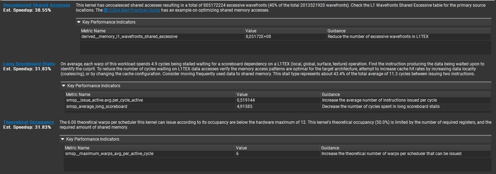

### Throughput

Compute throughput increased by 103%, but kernel duration still worsened (+90%) because:

- Overall memory throughput dropped to ~68% of peak.
- DRAM throughput dropped to ~61% of peak.
- Aggregate memory bandwidth decreased ~30% to 182.5 GB/s.

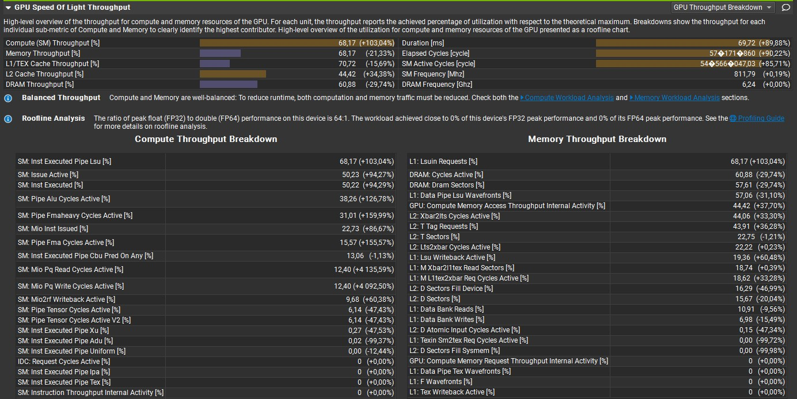

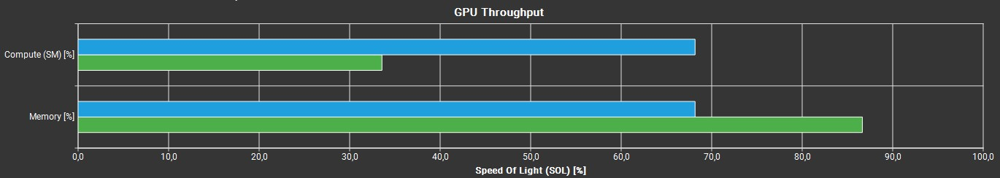

### Roofline

Both kernels remain strongly memory bound according to the roofline analysis.

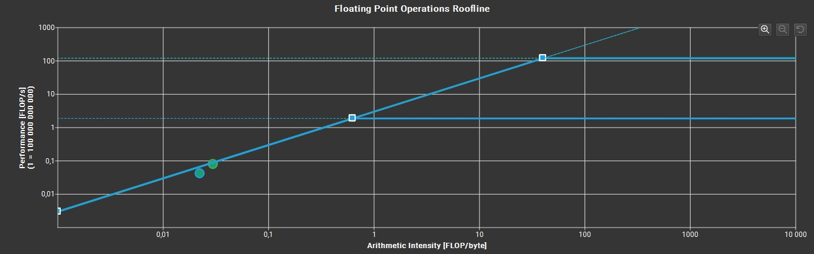

### Compute Workload

Observed compute-workload metrics show ~doubling of Instruction Per Clock as well as SM core instruction throughput ("SM busy [%]").

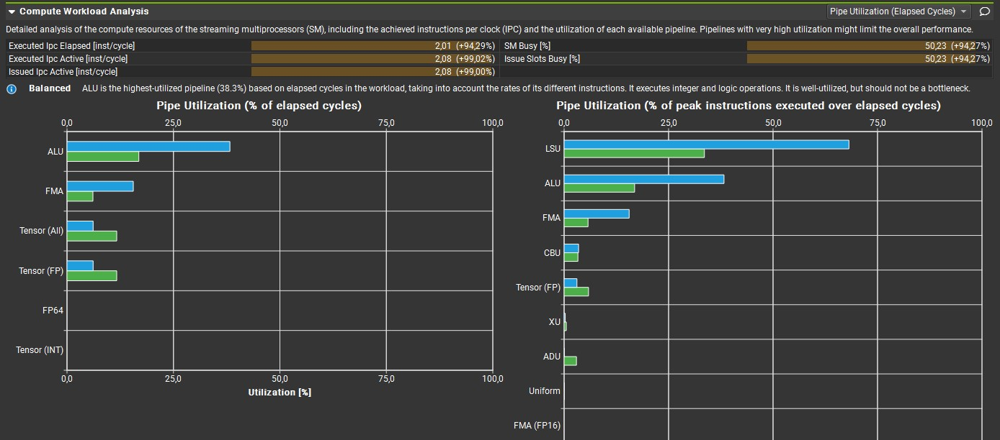

### Memory Workload

- Memory throughput decreased ~30% to 182.5 GB/s.
- 'Mem Busy' decreased ~31% and max bandwidth decreased ~21%.
- L1 hit rate decreased ~57%; L2 hit rate increased ~93% (more L2 servicing).
- Swizzling reduced shared-store bank conflicts by ~37%, but shared-load bank conflicts did not improve.

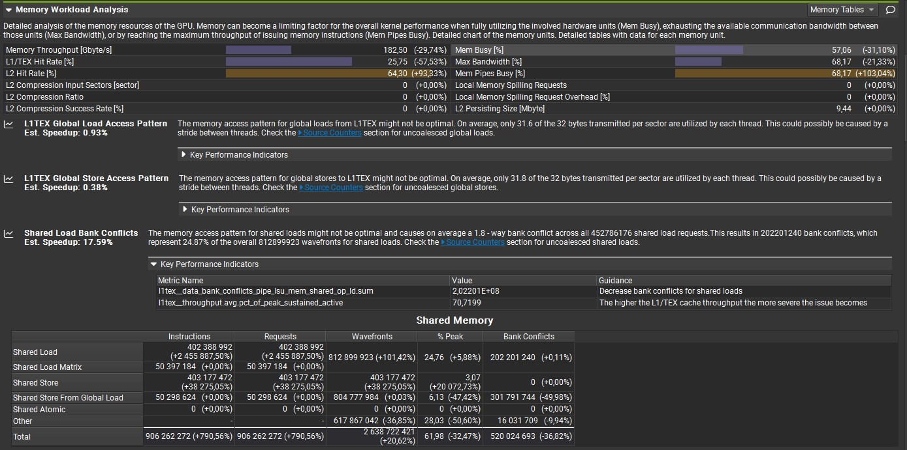

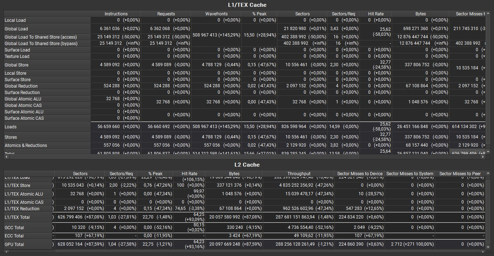

Close-up on the DRAM throughput reduction:

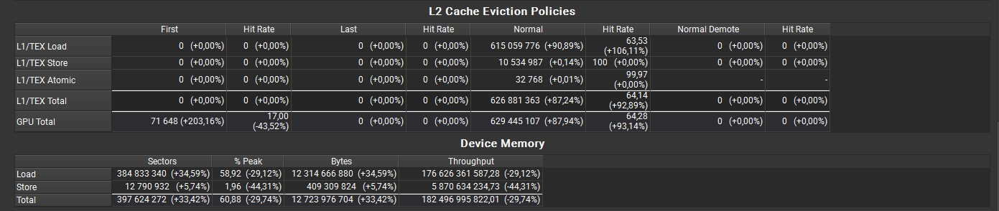

### Scheduler Statistics

Scheduler eligibility and issue rates improved (eligible ↑170% toward 1.0, issued ↑100%), but these improvements could not overcome the new on-chip latency sources.

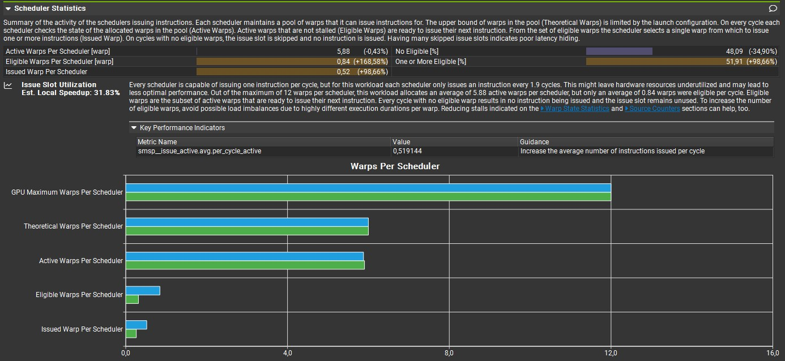

### Warp State Statistics

Warp cycle activity improved (warp cycles reduced ~50%), indicating better warp-level work distribution.

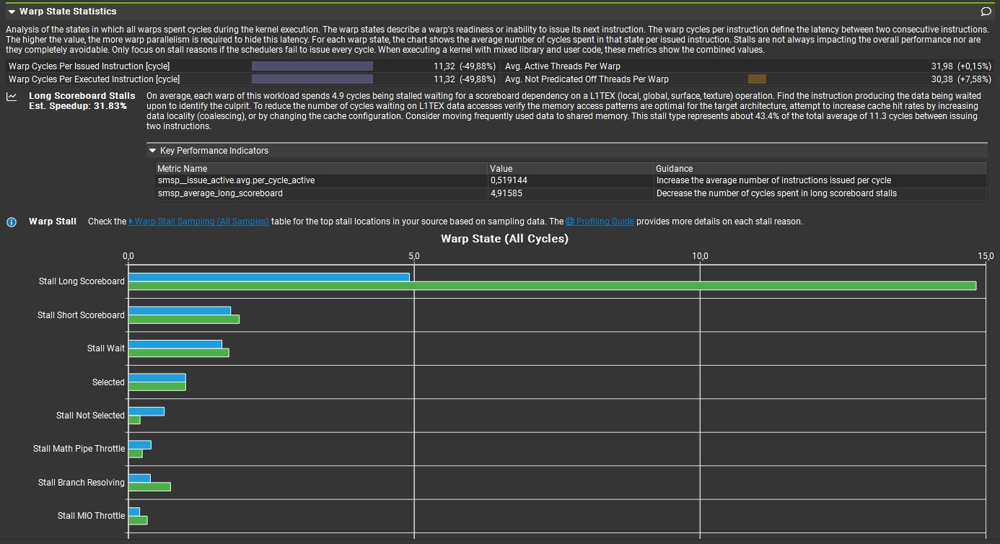

### Instruction Statistics

Instruction counts increased substantially (executed and issued ↑~270%), contributing to higher on-chip pressure and longer execution.

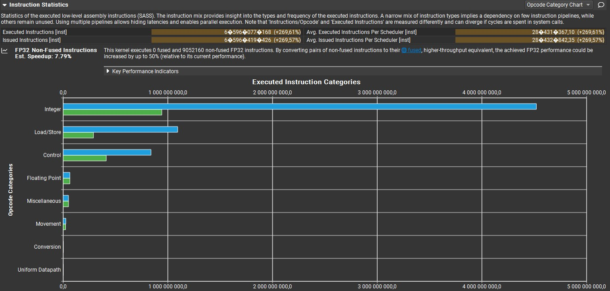

### Launch Statistics

No major changes in launch parameters other than a modest increase in register pressure.

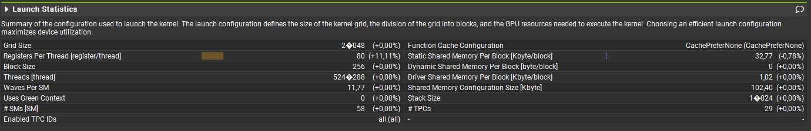

### GPU and Memory Workload

Average active cycles increased for DRAM by ~33%; for SM, SMSP, L1 and L2 the average active cycles rose by ~90%.

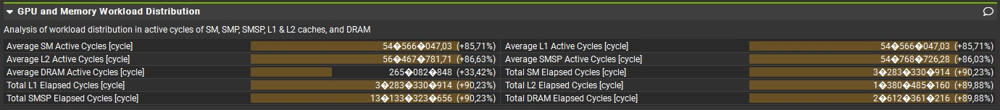

## Summary

`swizzle_xor` partially addressed the shared-memory bottlenecks of `capacity.cu`: shared-store bank conflicts dropped ~37% and uncoalesced shared accesses decreased. The higher L2 hit rate (+93%) further reduced DRAM traffic.

However, the approach introduces an unswizzle pass and additional copy instructions to satisfy `wmma::load_matrix_sync`'s requirement for a linear row-major layout in shared memory. This inflated instruction counts by ~270%, drove long scoreboard stalls from ~13% to ~32% of warp cycles, and degraded L1 effectiveness — shifting the dominant bottleneck from DRAM and shared-memory conflicts to on-chip instruction throughput and latency.

**Net result: +90% longer kernel duration.** The external (DRAM/shared-memory) bottleneck was traded for a new on-chip serialization bottleneck.

The path forward is `swizzle_ldmatrix`: by co-designing the swizzle layout with the PTX `ldmatrix`/`mma.sync` consumption pattern, the unswizzle overhead is eliminated entirely and the tensor-core data path is fed directly from the conflict-free swizzled layout.

## Adding `ldmatrix`

### Motivation

`swizzle_xor` swizzles the stored layout but still pays an extra reorder/unswizzle cost to restore the linear layout required by `wmma::load_matrix_sync`. `swizzle_ldmatrix` eliminates this overhead by co-designing the swizzle layout with the PTX-level `ldmatrix`/`mma.sync` consumption path.

Concrete goals:

- Reduce shared-memory bank conflicts at the point that matters most (the tensor-core load).
- Avoid extra shared-memory reshuffling (no unswizzle pass).
- Feed `ldmatrix`/`mma.sync` in a layout they can consume directly.

Note: PTX is not strictly required — what matters is that the consumer reads the swizzled layout directly without a fixup pass. PTX `ldmatrix`/`mma.sync` provides the pointer-level control that makes this possible.

### Why `swizzle_ldmatrix` Does Not Require Unswizzle

**Key insight.** Swizzling is an address remapping applied at the **register → SRAM store step**: when writing a tile into shared memory, each element is stored at a remapped address (chosen to spread elements across distinct banks). The element values in DRAM and registers are untouched; only *where* each element lives in SRAM changes. The consequence is that a consumer reading SRAM must either (a) know the remapped layout and follow it with custom per-thread pointers, or (b) undo the remapping (unswizzle) before reading. `ldmatrix` enables (a); `wmma::load_matrix_sync` is forced into (b).

`wmma::load_matrix_sync` requires a **linear row-major** layout in shared memory. The hardware reads elements at `&tile[row * ld + col]` and maps them to registers according to a fixed hardware scheme. If the data has been swizzled (addresses rearranged), the hardware still reads at those same linear addresses and consumes the wrong values — so the data must be unswizzled first to restore the expected linear order.

`ldmatrix` works differently: **each of the 32 threads in the warp supplies its own pointer** into shared memory. The hardware gathers 8 bytes from each 8-byte-aligned address and distributes the values into registers according to the `mma.sync` fragment layout. This means:

- You design the swizzle so that the address thread `t` supplies lands on a different bank than the addresses supplied by threads in the same 8-thread group.
- All 32 addresses are issued simultaneously, each hitting a distinct bank — no conflict.
- The gathered register values are already in the exact layout `mma.sync` expects, because the swizzle was designed to match that layout from the start.

In short:

- `wmma::load_matrix_sync` — layout is **hardware-fixed**; you must conform to it (linear data required; swizzled data must be unswizzled first).
- `ldmatrix` — layout is **pointer-driven**; the swizzled write addresses and the PTX read addresses are co-designed so the data lands exactly where the hardware needs it. The swizzled layout *is* the consumption layout — there is no "before" and "after".

That is why `swizzle_ldmatrix` removes the unswizzle overhead entirely.