# Sparse MoE Quantization Study — Nsight Compute Analysis

## Summary

Four hand-written CUDA kernels for a capacity-gated Sparse Mixture-of-Experts (MoE) matrix multiplication are implemented and profiled on an **NVIDIA L4 GPU (Ada Lovelace, SM 89)**. Each kernel targets a different numeric precision — FP16, FP8, INT8, and INT4 — using explicit **PTX `mma.sync`** intrinsics where the WMMA C++ API lacks support or where direct register control is required. Profiles were captured with **Nsight Compute** and analysed across: throughput, roofline, compute workload, memory workload, scheduler statistics, warp state statistics, and instruction statistics.

| Variant | Latency | vs FP16 | Primary Bottleneck |
|---|---:|---:|---|
| FP16 (WMMA baseline) | 37 ms | — | Memory-bound; highest DRAM throughput |
| FP8 (PTX)            | 39 ms | **−5% (slower)** | Instruction explosion — 4.1 B vs 1.8 B instructions for FP16 |
| INT8 (PTX)           | 30 ms | +19% | MIO Throttle and Long Scoreboard stalls |
| INT4 (PTX)           | 14 ms | **+2.6×** | Nearest to compute-bound; lowest DRAM active cycles |

The most counter-intuitive result is that **FP8 is slower than FP16**: despite Ada Lovelace having native FP8 Tensor Core support, the surrounding FP→INT conversion and predicate overhead generates 2.3× more executed instructions than the FP16 path. **INT4 achieves a 2.6× end-to-end speedup** and approaches compute-bound behaviour on the roofline.

---

## Kernels Profiled

| Kernel | Precision | API |
|---|---|---|
| [capacity.cu](../../../kernels/capacity.cu) | FP16 | WMMA — reference baseline |
| [capacity_fp8_ptx.cu](../../../kernels/capacity_fp8_ptx.cu) | FP8 | PTX `mma.sync` (WMMA lacks native FP8 types on Ada) |
| [capacity_int8_ptx.cu](../../../kernels/capacity_int8_ptx.cu) | INT8 | PTX `mma.sync` with manual 4 × int8 → int32 packing |
| [capacity_int4_ptx.cu](../../../kernels/capacity_int4_ptx.cu) | INT4 | PTX `mma.sync` with nibble-packed B-matrix operands |

## Ada Lovelace Precision Support

Target hardware: Ada Lovelace (SM 89, L4/RTX 40-class). Known precision support relevant to these kernels:

- FP8 (e8m0 / e4m3 / e5m2): native Tensor Core support on Ada Lovelace; the CUDA WMMA C++ API does not provide FP8 helpers, so FP8 use is typically via direct PTX `mma.sync` variants.
- INT8: native Tensor Core support; supported through WMMA and PTX.
- INT4: supported on Tensor Cores; experimental WMMA variants (e.g. `wmma::experimental::precision::s4`) exist but have known caveats — PTX `mma.sync` can be used for hand-written, explicit variants.
- FP4: not supported on Ada (FP4 appears in newer architectures such as Blackwell).

Notes: where the WMMA API lacks a convenience type (FP8), kernel implementations typically use PTX `mma.sync` intrinsics or hand-packed register formats.

## mma.sync Walkthrough: INT8 Register Packing

The animation below demonstrates how manual packing (4 × int8 into 1 int32) prepares operands for subsequent `mma.sync.aligned.m16n8k32.row.col.s32.s8.s8.s32` execution:

<video controls loop muted playsinline>
	<source src="https://github.com/user-attachments/assets/27d25ac7-e0bc-4680-b7cf-5d675062f1d0" type="video/mp4">
	Your browser does not support the video tag.
</video>

## Detailed Analysis

The colors below are used consistently across all Nsight Compute screenshots in this section:

| Color  | Variant | Kernel file | Latency |
|---|---|---|---:|
| Green  | FP16  | [capacity.cu](../../../kernels/capacity.cu) | 37 ms |
| Orange | FP8 (PTX) | [capacity_fp8_ptx.cu](../../../kernels/capacity_fp8_ptx.cu) | 39 ms |
| Purple | INT8 (PTX) | [capacity_int8_ptx.cu](../../../kernels/capacity_int8_ptx.cu) | 30 ms |
| Blue   | INT4 (PTX) | [capacity_int4_ptx.cu](../../../kernels/capacity_int4_ptx.cu) | 14 ms |

The "current" kernel highlighted in the Nsight Compute UI throughout these screenshots is [capacity_int4_ptx.cu](../../../kernels/capacity_int4_ptx.cu).

### Throughput

The FP16 baseline exhibits markedly higher Memory Throughput and lower Compute Throughput than the quantized variants, consistent with its larger per-element data footprint.

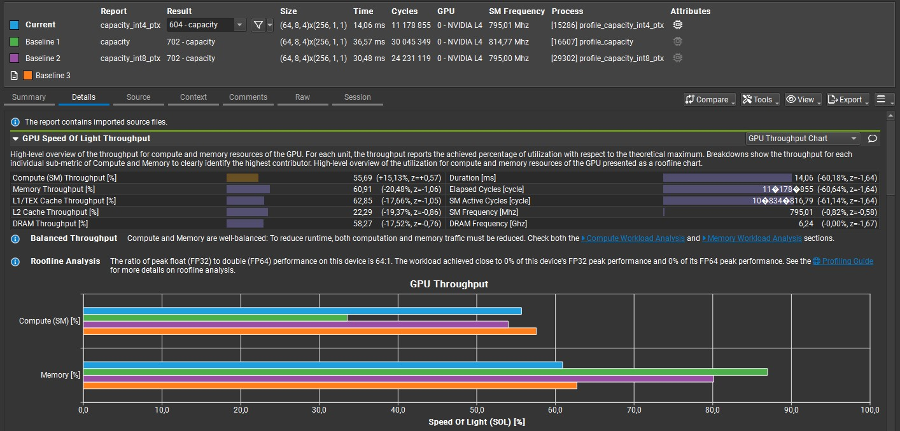

All four kernels are memory-bound; however, the roofline below illustrates how quantization progressively shifts the operating point towards compute-bound territory — INT4 is the closest to that boundary while FP16 is the furthest.

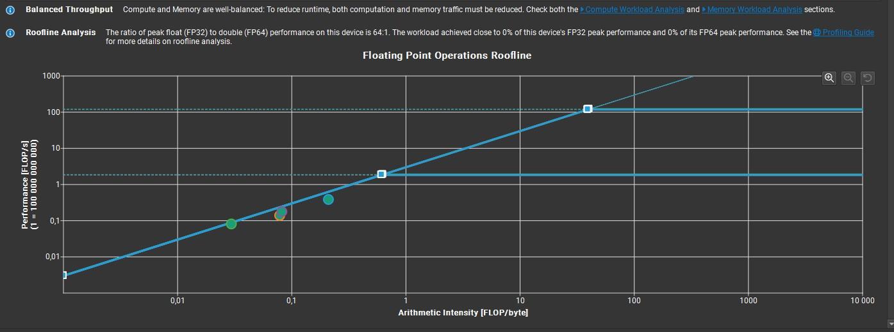

### Compute Workload

INT4 and FP8 exhibit markedly higher Executed Instructions Per Clock Active (~2.3) compared to INT8 and FP16 (~1.0).
For INT4 (blue), the Arithmetic Logical Unit (ALU) dominates — accounting for almost 50% of elapsed cycles, reflecting the dense integer compute workload.
The `XU` pipe (responsible for sin, cos, square root and int-to-float/float-to-int conversions) shows a large spike for FP8 (orange) — 23% of peak versus ~0–1% for all other variants. Across the remaining pipe types, FP8 maintains a high overall utilisation, a consequence of conversion overhead rather than mma compute throughput.

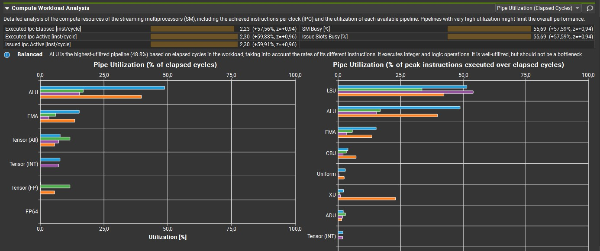

### Memory Workload

Memory throughput in Gbyte/s is highest for the FP16 baseline, as expected given its larger per-element data movement.
INT4 shows overall lower Memory Throughput figures as a percentage of peak, with one exception: Mem Pipes Busy (memory instruction throughput of the SMs) is comparatively elevated, reflecting the higher instruction dispatch rate of a more compute-intensive kernel.

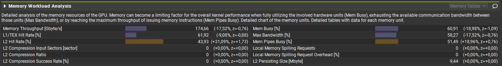

### Scheduler Statistics

Eligible and Issued Warps are significantly higher for INT4 and FP8 than for INT8 and FP16. Achieved Occupancy (~49% for all variants) is unchanged because it measures a different dimension: the static count of warps resident on the SM, which is capped by register and shared-memory limits. Eligible/Issued Warps is a dynamic per-cycle measure — fewer stall cycles mean more of the same resident warps have their operands ready and can be issued each cycle. Occupancy is therefore not a differentiating factor here and is not analysed separately.

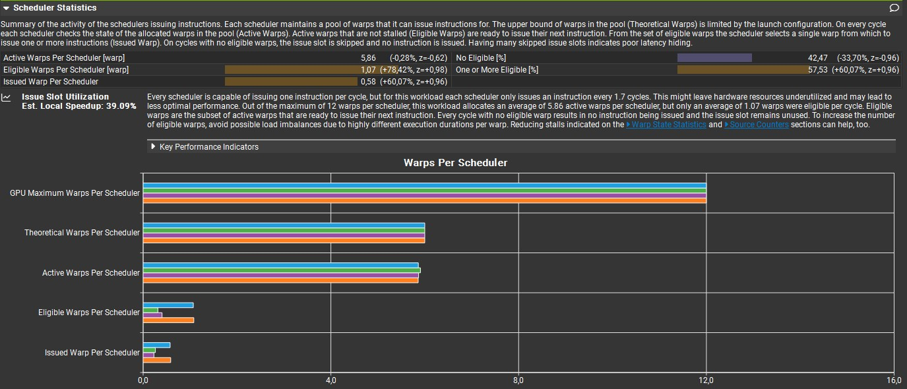

### Warp State Statistics

INT4 and FP8 have the shortest average inter-instruction stall time (~10 cycles each) versus FP16 (22.7 cycles) and INT8 (25.6 cycles).
This likely explains INT8's modest ~20% gain over FP16: warp execution is throttled by Stall MIO Throttle and Stall Long Scoreboard, indicating that memory sub-system latency is the limiting factor rather than instruction throughput.

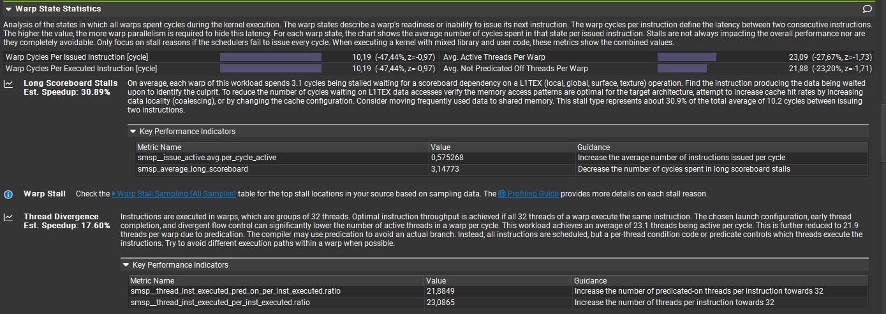

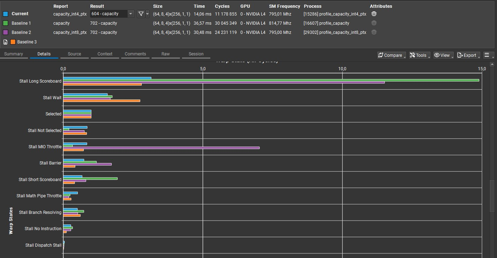

### Instruction Statistics

Instruction statistics explain the FP8 performance regression: FP8 executed 4.13 billion instructions versus 1.78 billion for FP16, 1.27 billion for INT8, and 1.44 billion for INT4 — a 2.3× overhead relative to the FP16 baseline.

FP8 dominates most instruction types, with large jumps in instruction count for:
- IMAD — Integer Multiply and Add
- BRA — Relative Branch
- BSSY — Synchronize Threads on a Convergence Barrier
- ISETP — Integer Compare and Set Predicate

Including extreme outliers:
- F2I — Float to Int Conversion
- HADD2 — FP16 Add
- FSETP — FP32 Compare and Set Predicate

...as well as non-trivial presence across nearly every other instruction type. This instruction explosion is the primary cause of FP8's net latency regression relative to FP16.

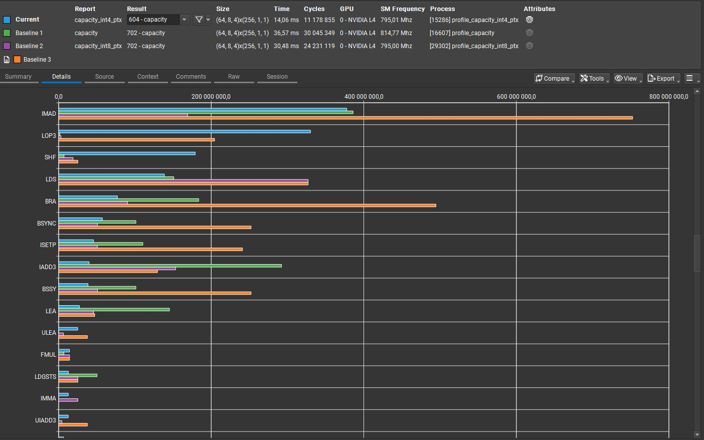
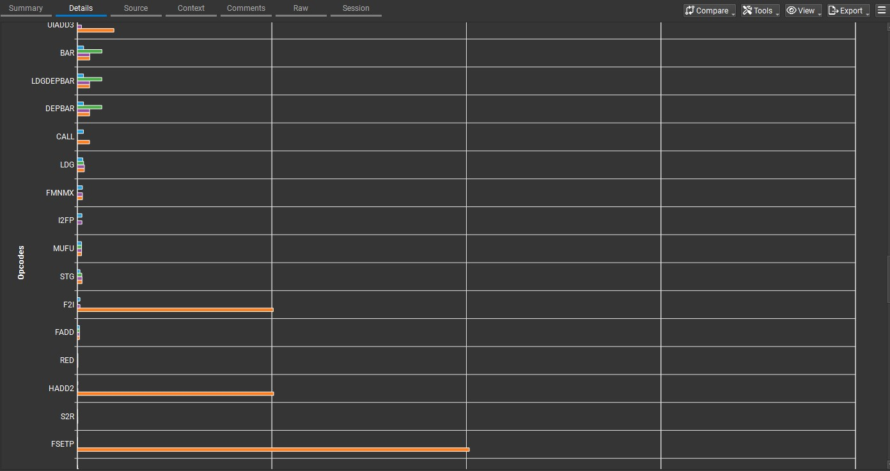

### GPU and Memory Workload Distribution

The "Average" in "Average Active Cycles" is computed per hardware partition (DRAM controller, L1 slice, L2 slice, SM, or SMSP). Rule of thumb: **Average Active = efficiency lens; Total Elapsed = time lens.**

The table below lists the number of partitions on the profiled L4 device.

| Unit | Count | Basis |
|---|---:|---|
| DRAM controllers | 6 | 192-bit bus ÷ 32-bit/controller |
| SMs | 58 | Explicit in Launch Statistics |
| L1 slices | 58 | One L1/TEX slice per SM |
| L2 slices | 24 | 24 MB total; ~1 MB per slice |
| SMSPs | 232 | 58 × 4 SMSPs per SM |

INT4 shows a large reduction in Average Active Cycles across all partition types, most notably at the DRAM controllers — confirming that quantization primarily reduces memory traffic rather than compute work per SM.

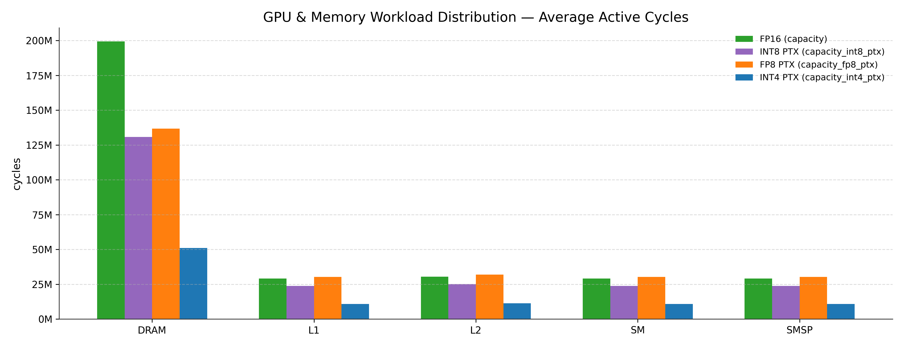

INT4 also shows a significant decrease in Total Elapsed Cycles. SMSP values are exactly 4× their SM counterparts (4 SMSPs per SM) and are included here for completeness.

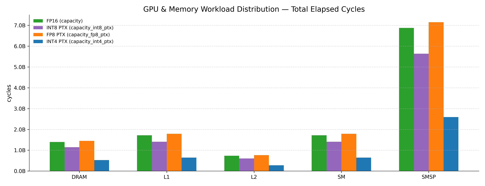

Utilization = Average Active / (Total Elapsed / N_partitions) answers whether a faster kernel does less work per partition or keeps partitions busier. For INT4, utilization drops most sharply at the DRAM controller — confirming that INT4 is faster primarily because it moves less data, not because it is less active at the compute level. Utilization across SM, L1, L2, and SMSP partitions is broadly consistent across all four variants.

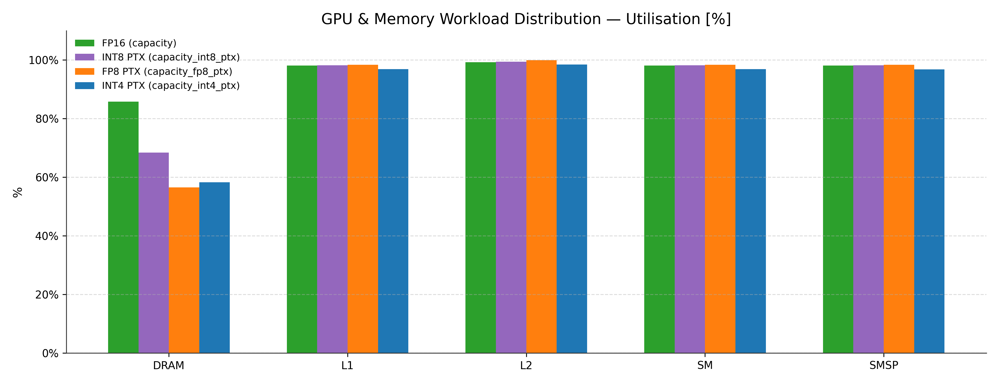

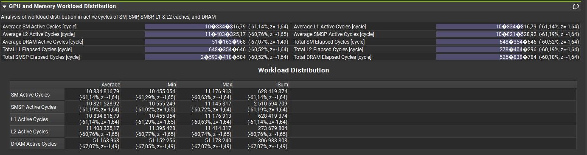

---

## Conclusions

### Performance Summary

Quantization type fundamentally reshapes both throughput and bottleneck category for this Sparse MoE kernel on Ada Lovelace:

- **INT4 (+2.6×)** — The standout result. Reducing operand bit-width to 4 bits approximately quarters the memory traffic relative to FP16, shifting the roofline operating point towards compute-bound territory. The key engineering challenge is correct nibble packing for B-matrix operands in `mma.sync.aligned.m16n8k32.row.col.s32.s4.s4.s32`.

- **INT8 (+19%)** — A genuine but modest gain. Warp State analysis identifies the bottleneck: Stall MIO Throttle and Stall Long Scoreboard account for the bulk of inter-instruction stall cycles, indicating that memory sub-system latency — not instruction throughput — is the limiting factor. Asynchronous prefetching (`cp.async`) or double-buffering would be the most direct next optimisation step.

- **FP8 (−5%, slower than FP16)** — The most instructive result. Despite Ada Lovelace having native FP8 Tensor Core support, this implementation incurs 4.13 billion executed instructions versus 1.78 billion for FP16 (2.3×). The `XU` pipe reaches 23% of peak utilisation (versus < 1% for all other variants), and F2I, HADD2, FSETP, ISETP, IMAD, and BRA counts all spike relative to the FP16 path. Reducing or fusing the FP→INT conversion logic surrounding each `mma.sync` is the primary lever for recovering FP8 performance.