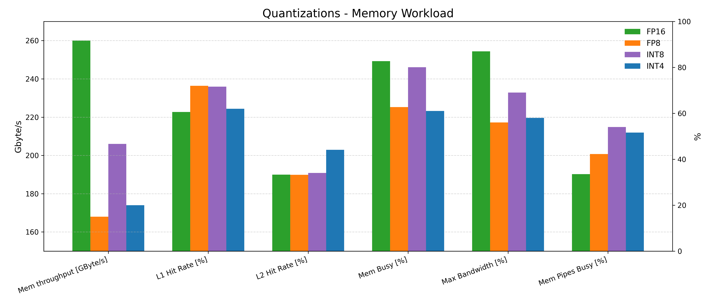

**Run7 - Quantizations - Overview**

Kernels profiled: [capacity.cu](kernels/capacity.cu), [capacity_int8_ptx.cu](kernels/capacity_int8_ptx.cu), [capacity_fp8_ptx.cu](kernels/capacity_fp8_ptx.cu), [capacity_int4_ptx.cu](kernels/capacity_int4_ptx.cu).

This document summarizes an NCU-based comparison between the following kernels:

- `capacity` — reference WMMA-backed kernel (FP16 baseline). Use as the baseline for compute-bound behavior and occupancy.
- `capacity_int8` — INT8 variant using higher-op throughput on Tensor Cores; expect improved throughput if memory layout and packing are optimal.
- `capacity_int8_ptx` — INT8 variant implemented with explicit PTX `mma.sync` (hand-packed registers); micro-optimizations may improve tensor-core utilization and reduce overhead compared to higher-level APIs.
- `capacity_fp8_ptx` — FP8 variant implemented via PTX `mma.sync` (needed because WMMA API lacks FP8 types); watch for quantization-induced accuracy vs performance trade-offs and for how many tensor lanes are active per instruction on Ada.
- `capacity_int4_ptx` — INT4 variant (packed nibbles) implemented with PTX; correctness of packing and B-layout is critical for correct mma operands and for maximizing throughput.

**Ada Lovelace Precision Support**

Target hardware: Ada Lovelace (SM 89, L4/RTX 40-class). Known precision support relevant to these kernels:

- FP8 (e8m0 / e4m3 / e5m2): native Tensor Core support on Ada Lovelace; the CUDA WMMA C++ API does not provide FP8 helpers, so FP8 use is typically via direct PTX `mma.sync` variants.
- INT8: native Tensor Core support; supported through WMMA and PTX.
- INT4: supported on Tensor Cores; experimental WMMA variants (e.g. `wmma::experimental::precision::s4`) exist but have known caveats — PTX `mma.sync` can be used for hand-written, explicit variants.
- FP4: not supported on Ada (FP4 appears in newer architectures such as Blackwell).

Notes: where the WMMA API lacks a convenience type (FP8), kernel implementations typically use PTX `mma.sync` intrinsics or hand-packed register formats.

**mma.sync with int8**

For the purpose of better understanding how mma.sync with quantization works below is an animation of how manual packing (4-packs of int8 into 1 int32)  for subsequent `mma.sync.aligned.m16n8k32.row.col.s32.s8.s8.s32` execution works:

## Detailed Analysis

The colors below correspond to the following:

| Color  | Variant | Kernel file | Time |
|---|---|---|---:|
| Green  | FP16  | [capacity.cu](kernels/capacity.cu) | 37 ms |
| Orange | FP8 (PTX) | [capacity_fp8_ptx.cu](kernels/capacity_fp8_ptx.cu) | 39 ms |
| Purple | INT8 (PTX) | [capacity_int8_ptx.cu](kernels/capacity_int8_ptx.cu) | 30.5 ms |
| Blue   | INT4 (PTX) | [capacity_int4_ptx.cu](kernels/capacity_int4_ptx.cu) | 14 ms |

### Throughput

Note the significantly higher Memory Throughput and lower Compute Throughput of the least-quantized version which is the fp16 [capacity.cu](kernels/capacity.cu). 

All four kernels are memory bound, however the below roofline illustrates well how quantization allows to gradually move out of the "memory-bound" territory to the "compute-bound" territory. int4 is closest to compute-bound while fp16 is furthest from it. 

### Compute Workload

Interestingly, the Executed Instructions Per Clock Active is high for both int4 and fp8 (~2.3) and lower for int8 and fp16 (~1.0).
For the most quantized version (int4 in blue) - the Arithmetic Logical Unit dominates the % of elapsed cycles - almost 50%. 
Note also the large jump in the `XU` (responsible for functions such as sin, cos, square root and int-to-float/float-to-int conversions) pipe for fp8 (orange) - 23% of peak vs others ~0-1%. As you can see for the other pipe types - fp8 keeps them relatively busy compared to the other quantizations.

### Memory Workload

Memory throughput in Gbyte/s is highest in the least quantized (fp16) version. 
For the most quantized version (int4) you can see overall lower figures for the Memory Throughput expressed as % of peak metrics, other than Mem Pipes Busy (the memory instruction throughput of SMs) where it is on the higher side.  

### Scheduler Statistics

Interestingly, Eligible & Issued Warps achieve significantly better results for int4 and fp8. Even more interesting — this has almost no impact on Achieved Occupancy (~49% for all); this is why we leave the "Occupancy" section out of this analysis.

### Warp State Statistics

Warps wait the least between instructions for int4 and fp8 (both ~10 cycles) vs fp16 (22.7) and int8 (25.6).
This likely explains the relatively small (~20%) performance improvement of int8 vs fp16, driven by increased Stall MIO Throttle and Stall Long Scoreboard.

### Instruction Statistics 

Instructions statistics provide a glimpse on why there was a deterioration in performance for the fp8 kernel (in orange) - fp8 had 4.13bn executed instructions vs 1.78bn of fp16, 1.27bn of int8 and 1.44bn of int4.

fp8 dominates most instruction types with large jumps in instruction count for: 
- IMAD - Integer Multiply and Add
- BRA - Relative Branch
- BSSY - Synchronize Threads on a Convergence Barrier
- ISETP - Integer Compare and Set Predicate

Including extreme outliers: 
- F2I - Float to Int Conversion
- HADD2 - FP16 Add
- FSETP - FP32 Compare and Set Predicate

And presence in almost all other Instruction Types!

### GPU and Memory Workload Distribution

Here, "Average" is computed per partition (DRAM controller, L1 slice, L2 slice, SM, or SMSP). The table below lists the number of partitions on the profiled L4 device.

| Unit | Count | Basis |
|---|---:|---|
| DRAM controllers | 6 | 192-bit bus ÷ 32-bit/controller; derived from total DRAM elapsed and clock ratios |
| SMs | 58 | Explicit in Launch Statistics |
| L1 slices | 58 | One L1/TEX slice per SM (see Launch Statistics) |
| L2 slices | 24 | 24 MB total; ~1 MB per slice; derived from total L2 elapsed |
| SMSPs | 232 | 58 × 4 SMSPs per SM |

Rule of thumb: average active = efficiency lens; total elapsed = time lens.

Comparing Utilization = Average Active / (Total Elapsed / N_partitions) across quantizations reveals whether a faster kernel (INT4) is faster because it does less work per partition or because it keeps partitions busier. 

### Instruction Statistics

